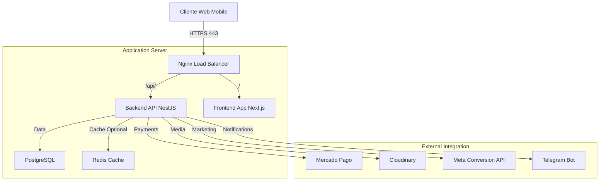
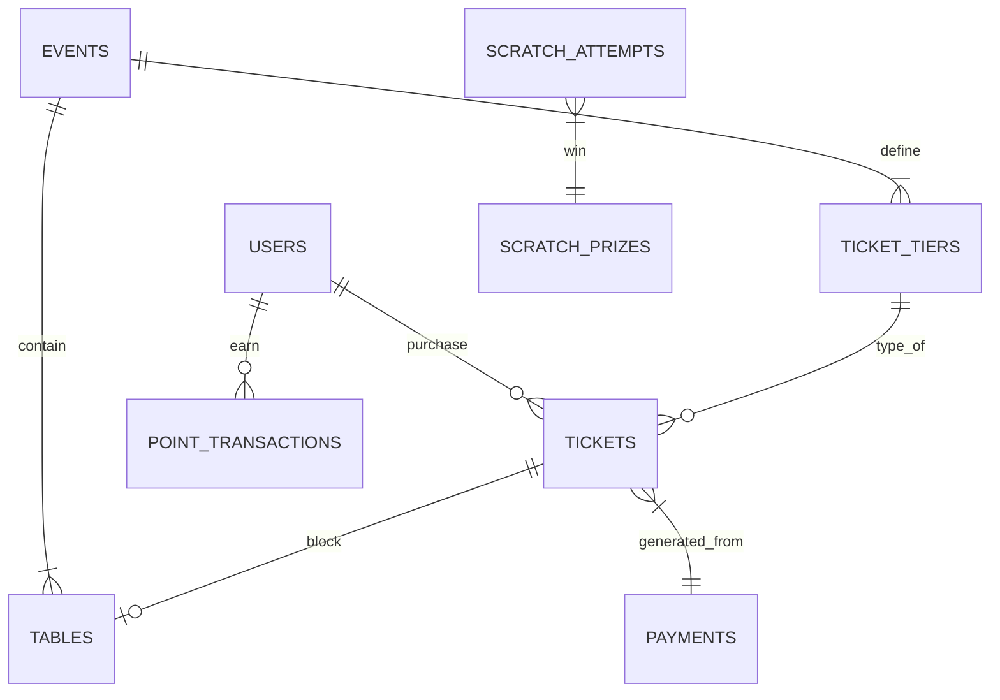

# Arquitectura del Sistema - SUCHT Platform

## 1. Visión General de Arquitectura

**SUCHT** es una plataforma construida bajo una arquitectura de **Monolito Modular** escalable, diseñada para soportar alta concurrencia durante eventos masivos (venta de entradas en tiempo real).

El sistema desacopla el **Backend (API)** del **Frontend (Cliente)**, permitiendo despliegues independientes (aunque actualmente orquestados juntos) y escalabilidad horizontal de la capa de recepción de tráfico.

### Diagrama de Alto Nivel

---

## 2. Stack Tecnológico

### Backend (Core)
*   **Framework:** [NestJS](https://nestjs.com/) (Node.js con TypeScript). Elegido por su arquitectura modular y soporte nativo de Inyección de Dependencias.
*   **Lenguaje:** TypeScript 5.x (Tipado estricto habilitado).
*   **Base de Datos Relacional:** PostgreSQL 16.
*   **ORM:** [TypeORM](https://typeorm.io/) (Patrón Data Mapper / Repository).
*   **Autenticación:** Passport.js + JWT (JSON Web Tokens). Estrategia RSA o SecretKey.

### Frontend (Client)
*   **Framework:** [Next.js 14](https://nextjs.org/) (Page Router / App Router híbrido).
*   **Estilos:** Tailwind CSS + ShadcnUI (Componentes accesibles).
*   **Estado Global:** [Zustand](https://github.com/pmndrs/zustand) (Ligero y sin boilerplate).
*   **Pagos:** SDK Oficial de Mercado Pago (`@mercadopago/sdk-react`).
*   **Mapas interactivos:** Renderizado Custom CSS/Canvas para mapas de mesas 3D.

### Infraestructura y DevOps
*   **OS:** Ubuntu LTS (Linux).
*   **Process Manager:** [PM2](https://pm2.keymetrics.io/) (Gestión de procesos node, logs y reinicios automáticos).
*   **Web Server:** Nginx (Reverse Proxy, SSL Termination, Gzip Compression).
*   **CI/CD:** Scripts Bash custom (`deploy.sh`) para despliegue Zero-Downtime mediante `pm2 reload`.

---

## 3. Topología de Base de Datos

El diseño de la base de datos se centra en la integridad transaccional para la venta de tickets.

### Diagrama Entidad-Relación (Simplificado)

---

## 4. Explicación Técnica Detallada

### Patrones de Diseño Utilizados

1.  **Repository Pattern:** Todas las interacciones con la base de datos se realizan a través de Repositorios de TypeORM inyectados en los Servicios. Esto desacopla la lógica de negocio del acceso a datos.
2.  **Dependency Injection (DI):** NestJS gestiona el ciclo de vida de todos los componentes. Esto facilita el testing y la modularidad (e.g., `PaymentsService` inyecta `TicketsService` para emitir entradas tras un pago).
3.  **Strategy Pattern (Auth):** Se utilizan estrategias intercambiables (`JwtStrategy`, `LocalStrategy`) para manejar la autenticación mediante Passport.js.
4.  **Observer/Event Pattern (Webhooks):** El sistema reacciona a eventos externos (como un pago de MercadoPago) de manera asíncrona a través de endpoints dedicados (`handleWebhook`), permitiendo que el sistema externo dicte el cambio de estado.

### Decisiones de Arquitectura Críticas

*   **¿Por qué Monolito Modular?** Dada la naturaleza del equipo y el proyecto, un monolito modular reduce la complejidad de infraestructura (no hace falta orquestar k8s) mientras mantiene el código organizado para una futura migración a microservicios si fuera necesario.
*   **Server-Side Rendering (Next.js):** Se eligió SSR para mejorar el SEO y la velocidad de carga inicial en móviles (crítico para usuarios con mala señal en eventos).
*   **Autonomía de Módulos:** Módulos como `Cerebro` (AI) y `Scratch` (Juego) están aislados. Si fallan, no afectan el flujo crítico de venta de entradas.

