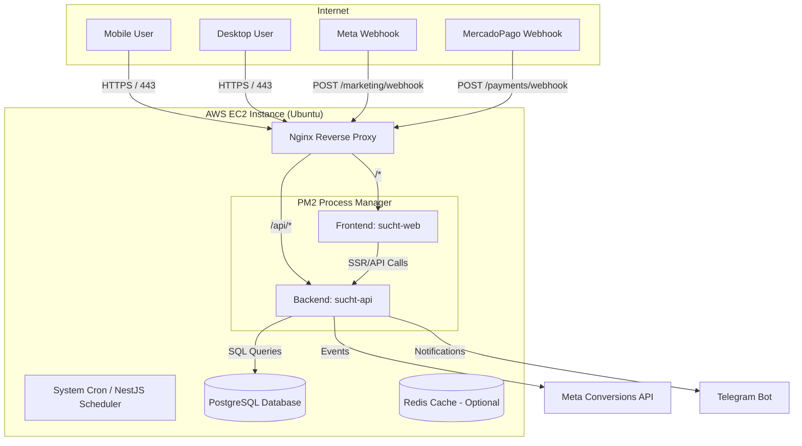
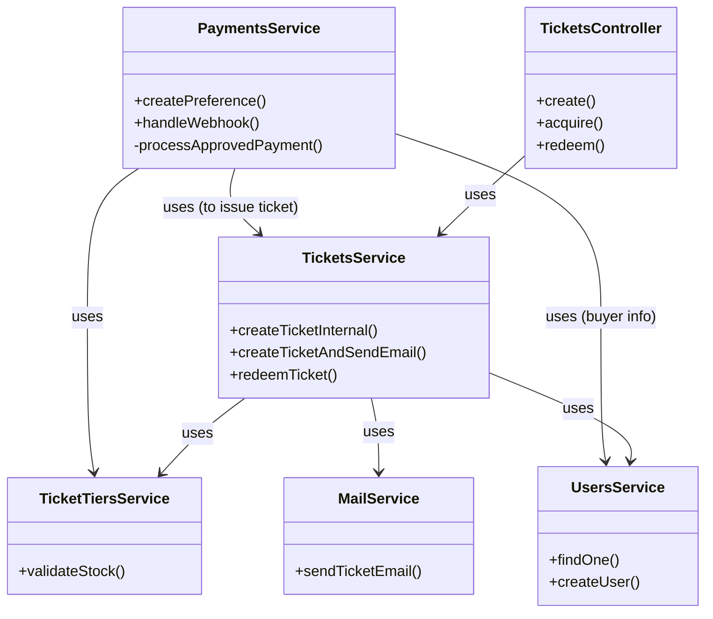
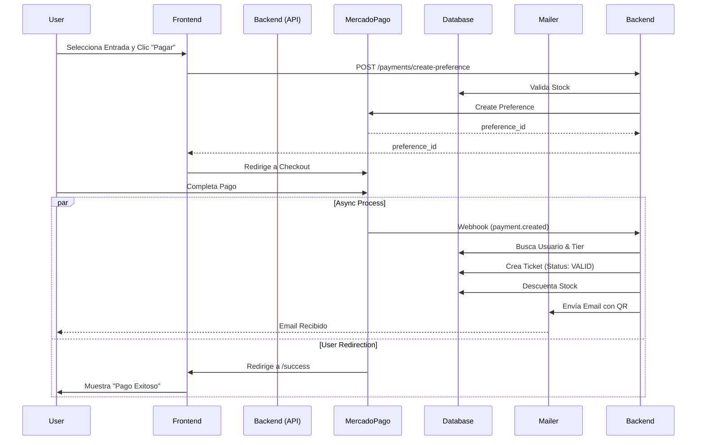
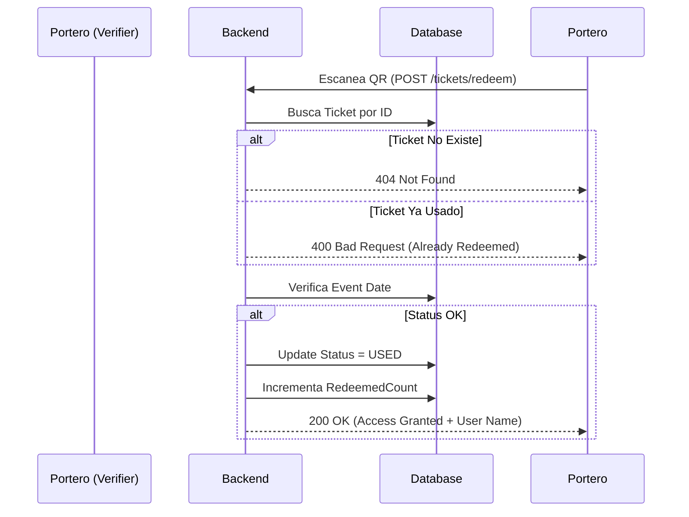
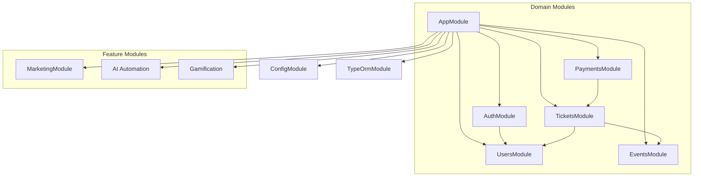

# Diagramas Técnicos y Flujos de Trabajo

Este documento centraliza todos los diagramas visuales del sistema SUCHT para facilitar la comprensión de la arquitectura y los flujos de datos.

## 1. Diagrama de Infraestructura Detallado

Muestra cómo se despliega la aplicación en el servidor AWS EC2 y cómo interactúan los componentes.

---

## 2. Diagrama de Dependencias de Clases (Backend Core)

Visualización de cómo interactúan los Servicios y Controladores principales del módulo de Tickets y Pagos.

---

## 3. Flujos de Trabajo (Sequence Diagrams)

### 3.1 Flujo de Compra de Entrada (End-to-End)

### 3.2 Flujo de Validación de Entrada (Scanner)

---

## 4. Diagrama de Arquitectura de Módulos (NestJS)

Cómo se organizan los módulos dentro del Monolito.

